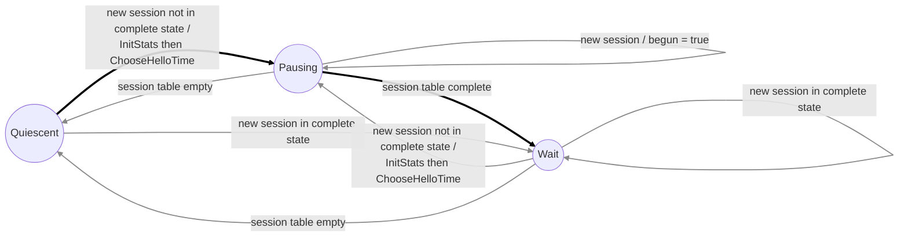

# LLTD Automata Specification

## Overview

This document describes the three finite state machines (automata) that implement the Link Layer Topology Discovery (LLTD) protocol behavior. Each automaton manages a specific aspect of the protocol:

1. **Mapping Engine State** - Handles topology discovery and mapping operations
2. **Enumeration Engine State** - Manages the enumeration of network stations
3. **Session Table State** - Tracks session states for discovered stations

These automata work together to provide complete LLTD protocol functionality as specified in the Microsoft LLTD specification.

## Legend

Throughout the state diagrams, transitions are styled to indicate their purpose:

- **Thick black lines** - Normal operational transitions
- **Thin gray solid lines** - Expected recovery transitions (timeout handling, state resets)
- **Thin gray dotted lines** - Error recovery transitions (handling unexpected messages)

---

## 1. Mapping Engine State Machine

The Mapping Engine automaton is responsible for the core topology discovery process. It coordinates the exchange of LLTD messages to build and maintain a network topology map.

### States

#### Quiescent (Q)
- **Description**: Idle state, waiting for topology discovery to begin
- **Purpose**: The responder is not actively participating in any mapping session
- **Entry conditions**: Initial state, or after Reset/inactive timeout

#### Command (C)
- **Description**: Active command processing state
- **Purpose**: Processes various LLTD commands and maintains the mapping session
- **Entry conditions**: Receives a Discover message while in Quiescent state
- **Key behaviors**:
  - Processes Query/QueryResp, QueryLargeTlv/QueryLargeTlvResp messages
  - Adds Probe messages to the topology log
  - Handles Charge messages with charge timeout counter (ctc)
  - Can transition to Emit state for multi-station enumeration

#### Emit (E)
- **Description**: Emitting topology information state
- **Purpose**: Transmits Probe or Train messages to enumerated stations
- **Entry conditions**: Receives Emit command from Command state
- **Key behaviors**:
  - Maintains a list of emitees (stations to probe/train)
  - Transmits Probe or Train messages to each emitee
  - Adds Probe responses to topology log
  - Returns to Command state when all emitees have been processed

### State Diagram

```mermaid
flowchart LR
  %% Styles (edges):
  %% - normal transition: thick black
  %% - expected recovery: thin gray solid
  %% - error recovery: thin gray dotted

  Q((Quiescent))
  C((Command))
  E((Emit))

  %% -------------------------
  %% Normal transitions (0..10)
  %% -------------------------
  Q -->|Discover acking| C
  C -->|Emit| E
  E -->|done emitees / ACK| C
  C -->|Reset| Q

  E -->|Probe / add to log| E
  E -->|pause / tx emitee (Probe or Train)| E

  C -->|Query / QueryResp<br/>trim from log| C
  C -->|QueryLargeTlv / QueryLargeTlvResp| C
  C -->|Probe / add to log| C
  C -->|Charge / ctc++<br/>then restart charge timeout| C
  C -->|Discover acking<br/>Emit QueryLargeTlv / QueryLargeTlvResp| C

  %% --------------------------------
  %% Expected recovery transitions (11..13)
  %% --------------------------------
  C -->|charge timeout / ctc=0| C
  C -->|inactive timeout| Q
  E -->|inactive timeout / Reset| Q

  %% -------------------------
  %% Error recovery (14..16)
  %% -------------------------
  Q -->|ACK, Charge, Emit, Flat, Hello, Probe, Query,<br/>QueryLargeTlv, QueryLargeTlvResp, QueryResp, Reset, Train<br/>(ignore)| Q
  C -->|ACK, Flat, Hello, QueryLargeTlvResp, QueryResp, Train<br/>(ignore)| C
  E -->|ACK, Charge, Emit, Flat, Hello, Probe, Query,<br/>QueryLargeTlv, QueryLargeTlvResp, QueryResp, Reset, Train<br/>(ignore)| E

  %% -------------------------
  %% Edge styling by index
  %% -------------------------
  linkStyle 0,1,2,3,4,5,6,7,8,9,10 stroke:#000,stroke-width:3px
  linkStyle 11,12,13 stroke:#888,stroke-width:1.5px
  linkStyle 14,15,16 stroke:#888,stroke-width:1.5px,stroke-dasharray:3 3
```

### Transitions

#### Normal Operational Transitions (0-10)

| # | From | To | Trigger | Action |
|---|------|----|---------| -------|
| 0 | Q | C | Discover (acking) | Begin mapping session |
| 1 | C | E | Emit command | Start emitting to stations |
| 2 | E | C | Done with emitees, send ACK | Return to command processing |
| 3 | C | Q | Reset | End session, return to idle |
| 4 | E | E | Probe received | Add to topology log |
| 5 | E | E | Pause / Transmit | Send Probe or Train to emitee |
| 6 | C | C | Query / QueryResp | Process query, trim log |
| 7 | C | C | QueryLargeTlv / QueryLargeTlvResp | Process large TLV query |
| 8 | C | C | Probe received | Add to topology log |
| 9 | C | C | Charge | Increment ctc, restart charge timeout |
| 10 | C | C | Discover acking, Emit QueryLargeTlv/QueryLargeTlvResp | Process additional commands |

#### Expected Recovery Transitions (11-13)

| # | From | To | Trigger | Action |
|---|------|----|---------| -------|
| 11 | C | C | Charge timeout | Reset ctc=0 |
| 12 | C | Q | Inactive timeout | Session expired, return to idle |
| 13 | E | Q | Inactive timeout | Send Reset, return to idle |

#### Error Recovery Transitions (14-16)

| # | From | To | Trigger | Action |
|---|------|----|---------| -------|
| 14 | Q | Q | Unexpected messages | Ignore (ACK, Charge, Emit, Flat, Hello, Probe, Query, QueryLargeTlv, QueryLargeTlvResp, QueryResp, Reset, Train) |
| 15 | C | C | Unexpected messages | Ignore (ACK, Flat, Hello, QueryLargeTlvResp, QueryResp, Train) |
| 16 | E | E | Unexpected messages | Ignore (ACK, Charge, Emit, Flat, Hello, Probe, Query, QueryLargeTlv, QueryLargeTlvResp, QueryResp, Reset, Train) |

### Implementation Notes

- **Charge Timeout Counter (ctc)**: Tracks the number of consecutive Charge messages. Reset to 0 on timeout.
- **Inactive Timeout**: If no activity occurs within the timeout period, the session is terminated.
- **Topology Log**: Maintains a history of Probe messages received during the session.
- **Emitees**: A list of stations to which Probe or Train messages should be sent during the Emit state.

---

## 2. Enumeration Engine State Machine

The Enumeration Engine automaton manages the discovery and enumeration of network stations using Hello messages. It implements the RepeatBand algorithm to efficiently discover stations while minimizing network traffic.

### States

#### Quiescent (Q)
- **Description**: Idle state, no active enumeration
- **Purpose**: Waiting for a new session to enumerate
- **Entry conditions**: Initial state, or when session table becomes empty

#### Pausing (P)
- **Description**: Active enumeration with periodic Hello messages
- **Purpose**: Sending Hello messages according to RepeatBand algorithm
- **Entry conditions**: New session detected that is not in complete state
- **Key behaviors**:
  - Manages hello_timeout and block_timeout
  - Tracks received Hello messages with counter r
  - Adjusts Hello transmission timing based on RepeatBand parameters
  - Updates statistics (UpdateStats) and chooses next Hello time (ChooseHelloTime)

#### Wait (W)
- **Description**: Waiting state after session table is complete
- **Purpose**: Monitor for new sessions while session table is complete
- **Entry conditions**: Session table becomes complete
- **Key behaviors**:
  - Watches for new incomplete sessions
  - Transitions back to Pausing if new incomplete session appears

### State Diagram



### Transitions

#### Normal Operational Transitions (0-1)

| # | From | To | Trigger | Action |
|---|------|----|---------| -------|
| 0 | Q | P | New session, not complete | Initialize statistics (InitStats), choose Hello time (ChooseHelloTime) |
| 1 | P | W | Session table complete | Wait for new incomplete sessions |

#### Expected Recovery Transitions (2-11)

| # | From | To | Trigger | Action |
|---|------|----|---------| -------|
| 2 | Q | W | New session, already complete | Skip enumeration |
| 3 | P | P | Existing session complete, table incomplete | Continue enumeration |
| 4 | P | P | Hello received | Increment r counter |
| 5 | P | P | Hello timeout | Send Hello, perform DoHello |
| 6 | P | P | Block timeout | Update statistics, choose next Hello time |
| 7 | P | P | New session | Set begun=true flag |
| 8 | W | W | New session, already complete | Continue waiting |
| 9 | W | P | New session, not complete | Re-enter enumeration: InitStats, ChooseHelloTime |
| 10 | P | Q | Session table empty | Return to idle |
| 11 | W | Q | Session table empty | Return to idle |

### RepeatBand Algorithm

The Enumeration Engine implements the RepeatBand algorithm to efficiently discover stations:

#### Constants (from lltdAutomata.h)

```c
#define BAND_NMAX 10000        // Maximum repetition count
#define BAND_ALPHA 45          // Scaling factor for Ni calculation
#define BAND_BETA 2            // Exponent for Ni calculation
#define BAND_GAMMA 10          // Minimum Hello messages before statistics
#define BAND_TXC 4             // Transmit count
#define BAND_FRAME_TIME 6.667  // Frame time in milliseconds
#define BAND_BLOCK_TIME 300    // Block time in milliseconds
```

#### State Variables

The `band_state` structure tracks:
- **Ni**: Current repetition count for Hello messages
- **r**: Number of Hello messages received in current block
- **begun**: Flag indicating enumeration has started

#### Algorithm Flow

1. **InitStats**: Initialize Ni=BAND_ALPHA, r=0, begun=false
2. **ChooseHelloTime**: Calculate next Hello transmission time based on Ni
3. **DoHello**: Transmit Hello message
4. **UpdateStats**: At block_timeout, update Ni based on received Hello count (r)
   - If r > 0 and begun: Ni = min(NMAX, ALPHA × r^BETA)
   - Adjust transmission rate based on network activity
5. **Repeat**: Continue until session table is complete

---

## 3. Session Table State Machine

The Session Table automaton manages the state of individual sessions for discovered network stations. This automaton is structurally identical to the Enumeration Engine but operates at the per-session level.

### States

#### Quiescent (Q)
- **Description**: No active sessions
- **Purpose**: Initial state, waiting for first session
- **Entry conditions**: Initial state, or when all sessions are removed

#### Pausing (P)
- **Description**: Active session management with Hello messages
- **Purpose**: Managing sessions that are not yet complete
- **Entry conditions**: New session added that is not in complete state
- **Key behaviors**:
  - Tracks session completion status
  - Manages per-session Hello timing
  - Updates session statistics

#### Wait (W)
- **Description**: All sessions complete
- **Purpose**: Monitor sessions while all are complete
- **Entry conditions**: All sessions reach complete state
- **Key behaviors**:
  - Watches for new incomplete sessions
  - Returns to Pausing if any session becomes incomplete

### State Diagram


### Transitions

The transitions for the Session Table automaton are identical to the Enumeration Engine, but operate on individual session entries rather than the global enumeration state.

#### Normal Operational Transitions (0-1)

| # | From | To | Trigger | Action |
|---|------|----|---------| -------|
| 0 | Q | P | New session, not complete | Initialize statistics, choose Hello time |
| 1 | P | W | Session table complete | All sessions complete |

#### Expected Recovery Transitions (2-11)

| # | From | To | Trigger | Action |
|---|------|----|---------| -------|
| 2 | Q | W | New session, already complete | Session already complete |
| 3 | P | P | Existing session complete, table incomplete | Continue with incomplete sessions |
| 4 | P | P | Hello received | Increment r counter |
| 5 | P | P | Hello timeout | Send Hello, perform DoHello |
| 6 | P | P | Block timeout | Update statistics, choose next Hello time |
| 7 | P | P | New session | Set begun=true flag |
| 8 | W | W | New session, already complete | Continue waiting |
| 9 | W | P | New session, not complete | Re-enter pausing state |
| 10 | P | Q | Session table empty | Return to idle |
| 11 | W | Q | Session table empty | Return to idle |

### Session States

Individual sessions can be in one of several states (from lltdAutomata.h):

```c
#define sess_discover_conflicting       0x00  // Conflicting Discover
#define sess_reset                      0x01  // Reset state
#define sess_discover_noack             0x02  // Discover without ACK
#define sess_discover_acking            0x03  // Discover with ACK
#define sess_discover_noack_chgd_xid    0x04  // Discover no ACK, changed XID
#define sess_discover_acking_chgd_xid   0x05  // Discover ACK, changed XID
#define sess_topo_reset                 0x06  // Topology reset
#define sess_hello                      0x07  // Hello state
```

### Session Completion

A session is considered "complete" when it has successfully exchanged all required Hello messages and topology information. The enumeration considers:

- **Complete**: `enum_sess_complete` (0x00)
- **Not Complete**: `enum_sess_not_complete` (0x01)

---

## Implementation Considerations

### Thread Safety

All three automata must be protected by appropriate synchronization mechanisms when accessed from multiple threads, particularly:
- Mapping Engine during packet reception
- Enumeration Engine during timeout handling
- Session Table during session updates

### Timeout Management

Each automaton relies on precise timeout handling:
- **Mapping Engine**: charge_timeout, inactive_timeout
- **Enumeration Engine**: hello_timeout, block_timeout
- **Session Table**: hello_timeout, block_timeout (per session)

Implementations should use monotonic clocks (e.g., `mach_absolute_time()` on macOS, `clock_gettime(CLOCK_MONOTONIC)` on Linux) to avoid issues with system clock adjustments.

### Memory Management

The automata use fixed-size transition tables (`MAX_TRANSITIONS = 128`) and state tables (`MAX_STATES = 5`). Implementations must ensure:
- Proper initialization of all state and transition entries
- Bounds checking when adding transitions
- Cleanup of associated data structures (topology log, emitee lists, session tables)

### Protocol Compliance

These automata implement the LLTD protocol as specified in the Microsoft LLTD specification. Implementations must:
- Respect all timeout values
- Handle all message types appropriately
- Implement proper error recovery
- Maintain topology log integrity
- Follow RepeatBand algorithm precisely

---

## References

- Microsoft Link Layer Topology Discovery Protocol Specification
- `lltdAutomata.h` - Automata data structures and constants
- `lltdAutomata.c` - Automata implementation
- `main_autom.c` - Main automata integration

---

## Document History

| Version | Date | Author | Changes |
|---------|------|--------|---------|
| 1.0 | 2026-01-06 | Initial | Created automata specification document |
